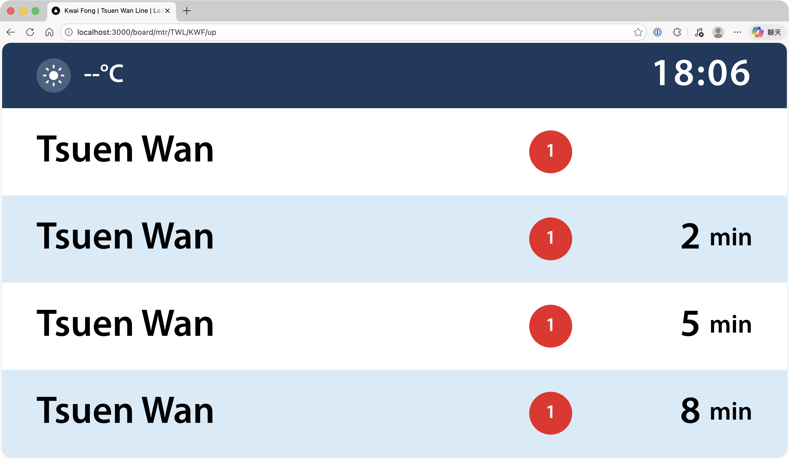

# Hong Kong Transport ETA Simulator

Hong Kong transport arrival display UI (MTR station screen style) with an extensible architecture that supports multiple transport operators through an adapter pattern.

**Live Demo**: [https://eta.mmc.dev](https://eta.mmc.dev)



## Tech Stack

- **Framework**: Next.js (Page Router) + TypeScript
- **Styling**: Tailwind CSS
- **Data Fetching**: SWR
- **Schema Validation**: Zod
- **Data Source**: DATA.GOV.HK APIs

## Development

```bash
npm install
npm run dev
```

Open [http://localhost:3000](http://localhost:3000) to see the app.

## Usage

### Sample Boards

- `/board/mtr/TWL/CEN/down` - MTR Tsuen Wan Line at Central (toward Central)
- `/board/mtr/TWL/TSW/down` - MTR Tsuen Wan Line at Tsuen Wan (toward Central)
- `/board/mtr/ISL/CHW/up` - MTR Island Line at Chai Wan (toward Chai Wan)
- `/board/mtr/EAL/LOW/up` - MTR East Rail Line at Lo Wu (branch line)
- `/board/mtr/TKL/POA/down` - MTR Tseung Kwan O Line at Po Lam (branch line)

### URL Pattern

```
/board/{operatorId}/{serviceId}/{stationId}/{direction?}
```

## Architecture

```
External API → Adapter → BoardState (unified model) → UI Components
```

The UI does not directly consume external API data. Each transport operator has an adapter that:

1. Fetches raw data from the operator's API
2. Validates and transforms it to the unified `BoardState` model
3. Declares supported capabilities (platform, crowding, etc.)

This allows adding new operators without modifying UI components.

### Adapter Capabilities

Each adapter declares what features it supports:

| Capability       | Description                      |
| ---------------- | -------------------------------- |
| `hasPlatform`    | Show platform number (MTR: yes)  |
| `hasCrowding`    | Show crowding level (planned)    |
| `hasNextStation` | Show next station info (planned) |
| `hasTrainLength` | Show train car count (planned)   |

## Scripts

```bash
npm run dev           # Start development server
npm run build         # Production build
npm run lint          # Run ESLint
npm run format        # Format with Prettier
npm run format:check  # Check formatting
npm run test          # Run tests
npm run test:watch    # Run tests in watch mode
npm run generate:mtr  # Regenerate MTR data from CSV
```

## MTR Data Generation

MTR line and station data is generated from `assets/mtr_lines_and_stations.csv` using the `scripts/generate-mtr-data.ts` script.

### Branch Line Handling

The script handles MTR lines with branches by merging branch directions into their parent line:

- **East Rail Line (EAL)**: Lok Ma Chau branch (LMC-DT/LMC-UT) is merged into main EAL directions. Lo Wu and Lok Ma Chau are displayed as alternative termini (e.g., "Admiralty → Lok Ma Chau/Lo Wu").

- **Tseung Kwan O Line (TKL)**: LOHAS Park branch (TKS-DT/TKS-UT) is merged into main TKL directions. Po Lam and LOHAS Park are displayed as alternative termini (e.g., "North Point → LOHAS Park/Po Lam").

Direction labels show all alternative termini with "/" separator when a line has multiple branches.

### Regenerating Data

If you modify the CSV or the generation script:

```bash
npm run generate:mtr
```

## Features

- Real-time MTR arrival data from DATA.GOV.HK API
- MTR station screen style UI with line colors
- Platform information display
- Support for branch lines (East Rail Line to Lok Ma Chau/Lo Wu, Tseung Kwan O Line to LOHAS Park/Po Lam)
- Racecourse route indication for East Rail Line
- Arrival/Departing status indicators
- Train delay status display
- ETAs greater than 60 minutes are hidden for cleaner display

## Status

- **MTR**: Fully functional with real-time DATA.GOV.HK API integration
- **KMB, Citybus, Ferry**: Planned for future release

## Disclaimer

This application is provided "as is" for academic and educational purposes only. It is not affiliated with, endorsed by, or connected to any public transportation operator in Hong Kong, including but not limited to MTR Corporation Limited.

All data is sourced from [data.gov.hk](https://data.gov.hk) and related third-party providers. No warranty is made regarding accuracy, completeness, or timeliness of information.

This application should not be used for travel planning or any official purposes. The developer assumes no liability for any loss or damage arising from the use of this application.

## Acknowledgements

Inspired by [chrisys/train-departure-display](https://github.com/chrisys/train-departure-display).

## License

MIT
